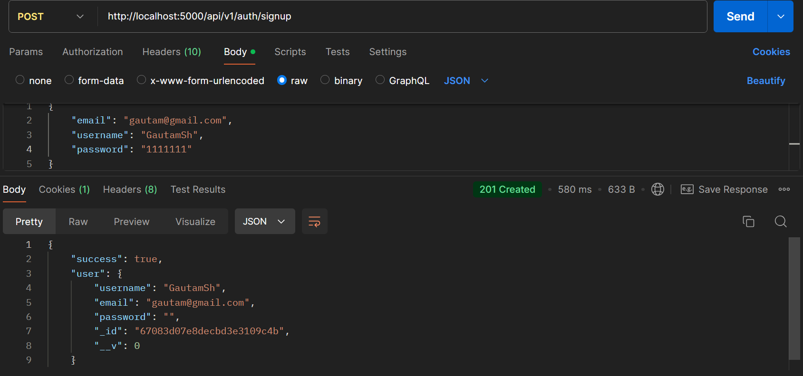
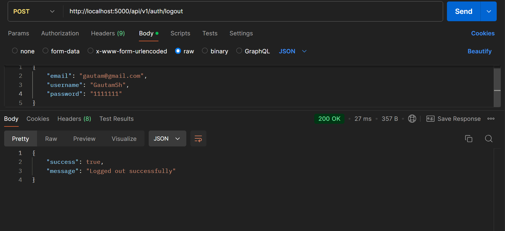
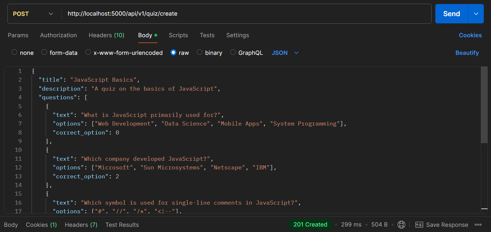
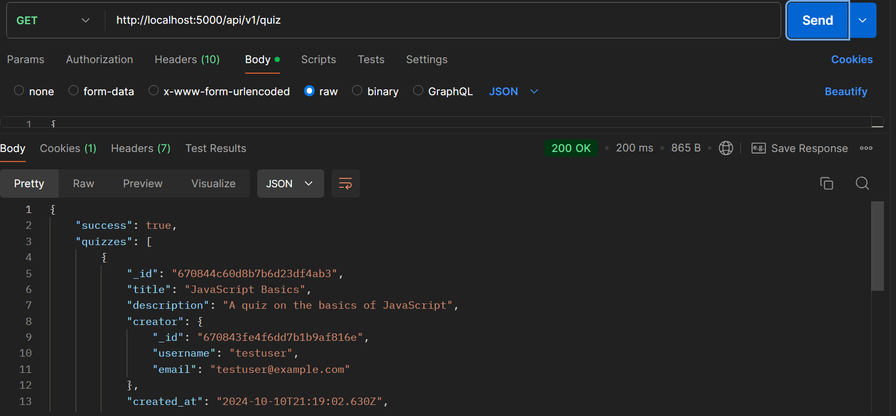
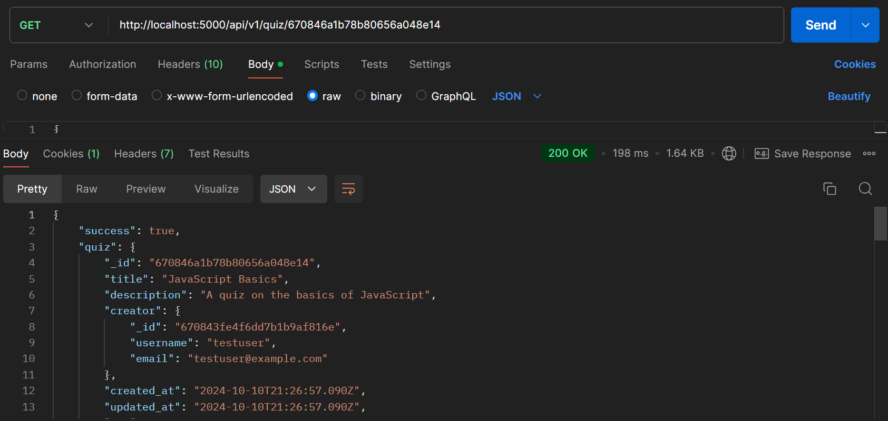
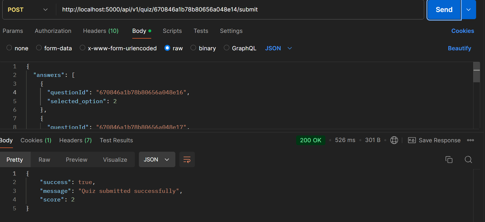
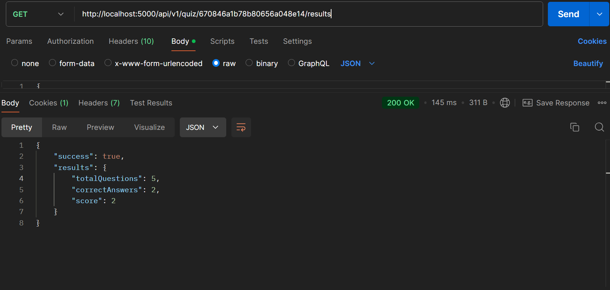

### Getting Started

```bash
PORT=5000
MONGO_URI=your_mongo_uri
JWT_SECRET=your_jwt_secret_key
```

### Start the app

```shell
npm run start
```

### Screenshots

<h2>User authentication screenshots</h2>
<a href="./public/ss1.png"></a>
<a href="./public/ss2.png"></a>
<a href="./public/ss3.png"></a>

<h2>Quiz create screenshot</h2>
<a href="./public/ss4.png"></a>

<h2>Get quiz screenshot</h2>
<a href="./public/ss5.png"></a>
<a href="./public/ss6.png"></a>

<h2>Submit and Result screenshot</h2>
<a href="./public/ss7.png"></a>
<a href="./public/ss8.png"></a>
